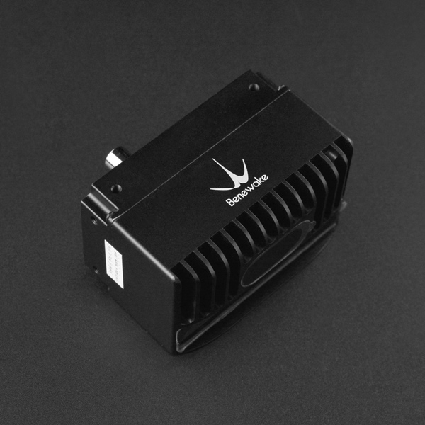

# DFRobot_CE30C
* [中文版](./README_CN.md)

CE30-C does not have any rotating components in the interior, which could ensure the reliability of long-time work and a wider vertical angle. Also, it features solid-state design, great service life, high stability and reliability, small size, 3D information, point-cloud data, and easy to integrate. There are integrated multi-machine interference determination and obstacle-avoidance algorithm integrated into the LiDAR to reduce the possibility of crosstalk.
This is a usage example code, the function is to get the module detected point cloud data.




## Product Link (https://www.dfrobot.com/product-2122.html)
    SKU: DFR0727


## Table of Contents

* [Summary](#summary)
* [Installation](#installation)
* [Methods](#methods)
* [Compatibility](#compatibility)
* [History](#history)
* [Credits](#credits)


## Summary

* Integrated Metal Surface, IP65 Enclosure Rating
* Solid State for high stability and reliability
* Wide FOV for obstacle avoidance
* 3D information, point-cloud data
* Small size, easy to integrate


## Installation

To use the library, first download the library file, paste it into the directory you specified, then open the Examples folder and run the demo in that folder.


## Methods

```python

# Processing image data: undistortion.py

def _bilinear_interpolation(_targetX, _targetY, _p11, _p12, _p21, _p22):
    '''!
        @brief Perform bilinear interpolation to calculate the value at a target position.
        @param _targetX X-coordinate of the target position
        @param _targetY Y-coordinate of the target position
        @param _p11 Value at position (0, 0)
        @param _p12 Value at position (0, 1)
        @param _p21 Value at position (1, 0)
        @param _p22 Value at position (1, 1)
        @return Interpolated value at the target position
    '''

def _remap(_src, _mapX, _mapY, _h, _w):
    '''!
        @brief Remap the source image using the provided mapping coordinates.
        @param _src Source image
        @param _mapX X-coordinate mapping
        @param _mapY Y-coordinate mapping
        @param _h Height of the remapped image
        @param _w Width of the remapped image
        @return Remapped image
    '''

def _inverse_matrix(_A, _n):
    '''!
        @brief Calculate the inverse of a square matrix using Gaussian elimination.
        @param _A Square matrix to invert
        @param _n Size of the matrix
        @return Inverse of the matrix
    '''

def _init_fisheye_map(_cameraMatrix, _coeffs, _height, _width):
    '''!
        @brief Initialize the fisheye distortion mapping.
        @param _cameraMatrix Camera matrix
        @param _coeffs Distortion coefficients
        @param _height Height of the fisheye map
        @param _width Width of the fisheye map
        @return Fisheye distortion mapping (_mapx, _mapy)
    '''

# Data exchange, sending and receiving data: dataExchange.py

def _recvdata(tcp, _row, _colum):
    '''!
        @brief Receive data over TCP socket and convert it into a numpy array.
        @param tcp TCP socket object
        @param _row Number of rows in the array
        @param _colum Number of columns in the array
        @return Numpy array representing the received data
    '''

def _sendmsg(tcp, _msg):
    '''!
        @brief Send a message over a TCP socket.
        @param tcp TCP socket object
        @param _msg Message to send
    '''

def _recvhex(tcp, _len):
    '''!
        @brief Receive hex-encoded data over a TCP socket and convert it into a numpy array.
        @param tcp TCP socket object
        @param _len Length of the received data
        @return Numpy array representing the received data
    '''

```


## Compatibility

* RaspberryPi Version

| Board        | Work Well | Work Wrong | Untested | Remarks |
| ------------ | :-------: | :--------: | :------: | ------- |
| RaspberryPi2 |           |            |    √     |         |
| RaspberryPi3 |           |            |    √     |         |
| RaspberryPi4 |           |            |    √     |         |

* Python Version

| Python  | Work Well | Work Wrong | Untested | Remarks |
| ------- | :-------: | :--------: | :------: | ------- |
| Python2 |           |            |     √    |         |
| Python3 |           |            |     √    |         |


## History

- 2023/07/07 - Version 1.0.0 released.


## Credits

Written by qsjhyy(yihuan.huang@dfrobot.com), 2021. (Welcome to our [website](https://www.dfrobot.com/))

