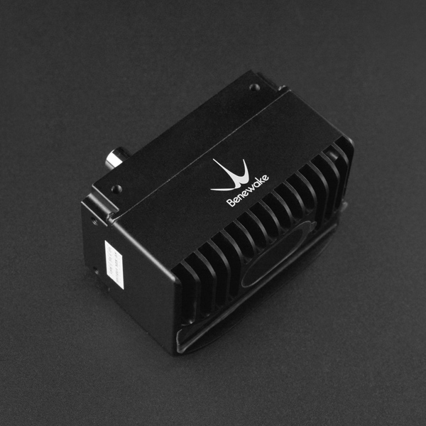

# DFRobot_CE30C
* [English Version](./README.md)

CE30-C面阵激光雷达 一款大视场角度，IP65防护的3D固态面阵激光雷达，能够完成三维探测可输出原始点云数据。
这是一个使用示例代码, 功能是获取模块检测到的点云数据。




## 产品链接 (https://www.dfrobot.com.cn/goods-2885.html)
    SKU: DFR0727


## 目录

* [概述](#概述)
* [库安装](#库安装)
* [方法](#方法)
* [兼容性](#兼容性)
* [历史](#历史)
* [创作者](#创作者)


## 概述

* 一体化金属机身IP65防护等级
* 全固态设计 稳定可靠 寿命长
* 大视场角 满足大范围探测的避障需求
* 三维探测 可输出原始点云数据
* 体积小 易装配 可适配多种场合


## 库安装

要使用库, 首先下载库文件, 将其粘贴到指定的目录中, 然后打开Examples文件夹并在该文件夹中运行演示。


## 方法

```python

# 处理图像数据:undistortion.py

def _bilinear_interpolation(_targetX, _targetY, _p11, _p12, _p21, _p22):
    '''!
        @brief 执行双线性插值以计算目标位置的值。
        @param _targetX 目标位置的X坐标
        @param _targetY 目标位置的Y坐标
        @param _p11 位置(0, 0)的值
        @param _p12 位置(0, 1)的值
        @param _p21 位置(1, 0)的值
        @param _p22 位置(1, 1)的值
        @return 目标位置的插值值
    '''

def _remap(_src, _mapX, _mapY, _h, _w):
    '''!
        @brief 使用提供的映射坐标重新映射源图像。
        @param _src 源图像
        @param _mapX X坐标映射
        @param _mapY Y坐标映射
        @param _h 重新映射图像的高度
        @param _w 重新映射图像的宽度
        @return 重新映射后的图像
    '''

def _inverse_matrix(_A, _n):
    '''!
        @brief 使用高斯消元法计算方阵的逆矩阵。
        @param _A 需要求逆的方阵
        @param _n 矩阵的大小
        @return 矩阵的逆
    '''

def _init_fisheye_map(_cameraMatrix, _coeffs, _height, _width):
    '''!
        @brief 初始化鱼眼畸变映射。
        @param _cameraMatrix 相机矩阵
        @param _coeffs 畸变系数
        @param _height 鱼眼映射的高度
        @param _width 鱼眼映射的宽度
        @return 鱼眼畸变映射（_mapx, _mapy）
    '''

# 数据交换，发送和接收数据：dataExchange.py

def _recvdata(tcp, _row, _colum):
    '''!
        @brief 接收通过TCP套接字传输的数据，并将其转换为NumPy数组。
        @param tcp TCP套接字对象
        @param _row 数组的行数
        @param _colum 数组的列数
        @return 表示接收数据的NumPy数组
    '''

def _sendmsg(tcp, _msg):
    '''!
        @brief 通过TCP套接字发送消息。
        @param tcp TCP套接字对象
        @param _msg 要发送的消息
    '''

def _recvhex(tcp, _len):
    '''!
        @brief 接收通过TCP套接字传输的十六进制编码数据，并将其转换为NumPy数组。
        @param tcp TCP套接字对象
        @param _len 接收数据的长度
        @return 表示接收数据的NumPy数组
    '''

```


## 兼容性

* RaspberryPi 版本

| Board        | Work Well | Work Wrong | Untested | Remarks |
| ------------ | :-------: | :--------: | :------: | ------- |
| RaspberryPi2 |           |            |    √     |         |
| RaspberryPi3 |           |            |    √     |         |
| RaspberryPi4 |           |            |    √     |         |

* Python 版本

| Python  | Work Well | Work Wrong | Untested | Remarks |
| ------- | :-------: | :--------: | :------: | ------- |
| Python2 |           |            |     √    |         |
| Python3 |           |            |     √    |         |


## 历史

- 2023/07/07 - 1.0.0 版本


## 创作者

Written by qsjhyy(yihuan.huang@dfrobot.com), 2021. (Welcome to our [website](https://www.dfrobot.com/))

